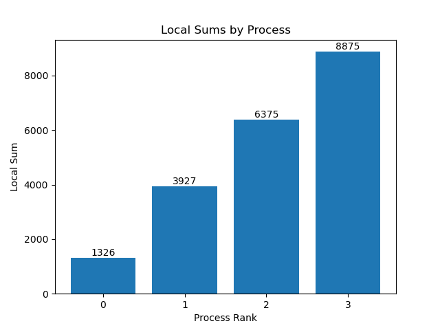

# Описание проекта

Использование MPI_Recv и MPI_Send вместо MPI_Reduce для выполнения суммирования. Проект включает C++ код для вычислений и Python код для визуализации результатов каждого ранга. 

`step` в коде используется для управления процессом объединения MPI_Recv и MPI_Send. Путем постепенного увеличения значения `step`, код реализует стратегию объединения парной коллекции.

## Использование

Используйте MPI для запуска C++ программы: **mpiexec -n 4 ./MPI.exe**

Здесь `4` можно изменить на любое количество рангов.
`MPI.exe` — это скомпилированный исполняемый файл.

## Результаты

Результаты суммирования для каждого ранга показаны на рисунке ниже.

